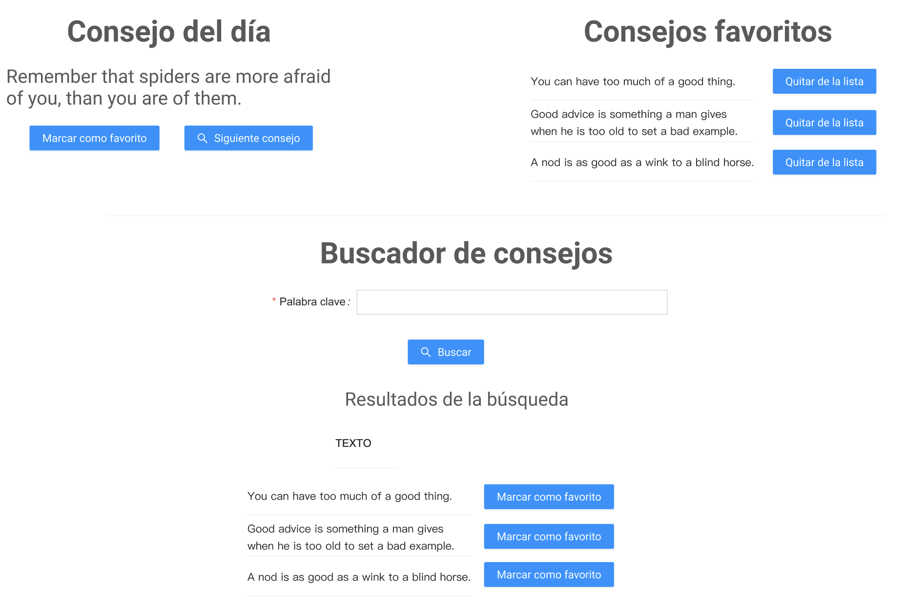

# Examen-Final
#### Result: 
### https://disenio-interfaces.web.app/
:horse:


* Escribir una aplicación de React que consuma los datos de la api https://api.adviceslip.com/. Esta api tiene los siguientes endpoints disponibles:

```
Obtiene un consejo aleatorio:
GET https://api.adviceslip.com/advice


Obtiene un consejo por id:
GET https://api.adviceslip.com/advice/{slip_id}


Permite buscar consejos por palabras clave:
GET https://api.adviceslip.com/advice/search/{query}
```

* La aplicación debe hacer lo siguiente:
  1. Al iniciar debe presentar un consejo aleatorio (https://api.adviceslip.com/advice).
  1. Se debe presentar un botón "Siguiente consejo" que presenta otro consejo aleatorio en pantalla.
  1. Junto al consejo se debe mostrar un botón "Marcar como favorito". Este botón agrega el presente consejo a una lista que se debe presentar en pantalla.
  1. Cada item de la lista de favoritos debe tener un botón "Quitar de mi lista de favoritos" que elimina el consejo de la lista.
  1. Debajo de esta primera sección debe presentar un campo de texto que permita escribir una palabra clave junto con un botón que permita buscar consejos (https://api.adviceslip.com/advice/search/{query}). Al presionar el botón, se deben mostar en una lista los consejos que coincidan con la palabra clave.
  1. Cada item en esta lista de resultados de la búsqueda debe contener el botón "Marcar como favorito". Se debe controlar que un consejo no se añada dos veces a la lista de favoritos.
  1. Desplegar la aplicación en Vercel
  
* Mockup: 


